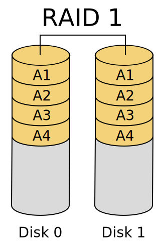

# RAID - Redundant array of independent disks

## RAID 0
- Keine Datenredundanz
- Beim Ausfall einer Festplatte sind die Daten unbrauchbar
- Parallele Schreib- und Lesezugriffe => Hohe Transferrate
- Nettokapazität = 100%

## RAID 1
- Volle Redundanz
- Daten werden gespiegelt gespeichert
- Parallele Lesezugriffe => Lesegeschwindigkeit hoch
- Nettokapazität = 50%
- Die Anzahl der Festplatten, die Ausfallen dürfen, hängt von der Anzahl der Festplatten und der Position dieser ab

## RAID 5
- Striping Verfahren
- Parity Verfahren

## RAID 6

## RAID 10

## Links